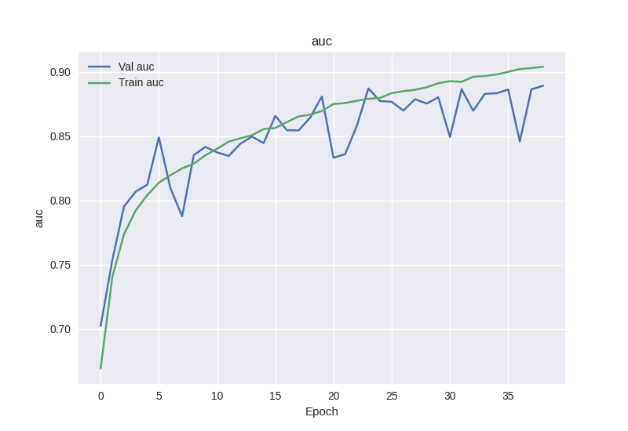

# Facial-Expression-Recognition
CNN on imbalanced FER Dataset using Keras on top of Tensorflow.

**NOTE**: No transfer learning (or any pre-trained weights such as those trained on imagenet) was used (although that would have improved the results), because that would defeat the purpose of training a CNN from scratch for an imbalanced dataset.

## Contents
* [Installation](#installation)
* [Why this project?](#why-this-project?)
* [How to use?](#how-to-use?)
    * [Pre-trained model](#use-pre-trained-model)
    * [Train from scratch](#train-from-scratch)
    * [Detect expressions](#detect-expressions)
* [Dataset](#dataset)
* [Model](#model)
    * [Training results](#training-results)
    * [Confusion Matrix](#confusion-matrix)
    * [Classification Report](#classification-report)
    * [Model Architecture](#model-architecture)

## Installation
* The [requirements.txt](./requirements.txt) file can be used for installing the necessary libraries.
```
pip install -r requirements.txt
```

## Why this project?
This project was mainly built to learn how to work with imbalanced datasets with Deep Learning. Provided how prone neural networks are to over-fitting, I decided to use this dataset with Convolutional Neural Networks, to try to build a model that would not suffer from over-fitting.

## How to use?
### Use pre-trained model
* To use the pre-trained model, download the model from the GitHub releases page, link [here](https://github.com/Gautam-J/Facial-Expression-Recognition/releases/download/v1.0/model.h5).
* Move the downloaded .h5 file inside the 'model' directory.
* Run [detect_expression.py](./detect_expression.py) file.

### Train from scratch
#### Get data
* Make a directory named 'data', and inside that, two directories named 'train' and 'test'.
* Inside each of those two directories, make a directory for each image class, and move the images in it accordingly.
#### Train a model
* Run [train.py](./train.py) to train a model for the FER dataset.
* Once the model is finished training, it is automatically saved, and results are plotted and saved under the 'models' directory.

### Detect Expressions
* Have the model that you want to use, named 'model.h5', under the 'model' directory.
* Run [detect_expression.py](./detect_expression.py) to run the trained model, and detect expressions using the webcam.
    * You might have to change the video capture number if you have multiple webcams, and want to change cameras.
* A pre-trained haarcascade classifier first detects a face, and a boundary box is drawn. The detected face is then cropped from the webcam input stream, preprocessed, and fed into the model.
* Press `q` to stop the running model and quit the script.

## Dataset
The Facial Expression Recognition (FER) dataset is an image classification task, wherein there are grayscale images of size (48, 48), and are to be classified into 7 different classes. It is also worthy to mention that the dataset is very much **imbalanced**, with the number of samples for each class ranging from 111 to 1774.

## Model
A convolutional neural network is used to train on this dataset, and since the dataset is imbalanced, class weights are calculated and passed, during the training phase. Also, AUC metric is tracked, along with accuracy and loss.

The default model architecture is defined in [model_configs.py](./model_configs.py) file. Dropout is used for regularization, along with Batch Normalization for faster convergence.

The Keras Image DataGenerator, defined under [generators.py](./generators.py) file is used for image augmentation during training phase, to prevent over-fitting and combat the imbalanceness in the dataset.

### Training results



### Confusion Matrix

### Classification Report


### Model Architecture

